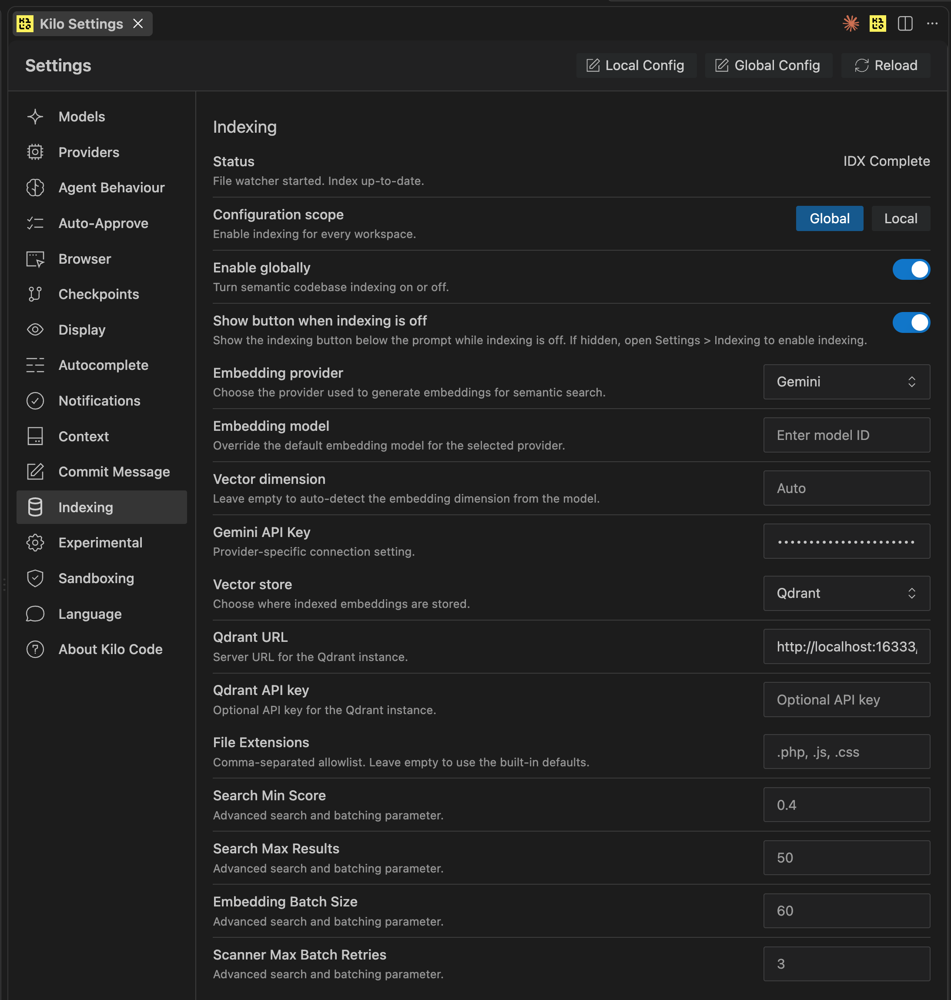

# 04 — Installing and Configuring Kilo Code Itself

`docs/02`/`03` assume Kilo Code is already installed and working. This doc
covers getting there: installing Kilo, picking/authenticating an LLM
provider, wiring always-on instruction files, and (optional) enabling
semantic codebase search backed by a local Qdrant.

## Table of Contents

- [Install](#install)
- [LLM / Model Configuration](#llm--model-configuration)
- [Always-on Instruction Files](#always-on-instruction-files)
- [Codebase Semantic Indexing (RAG) with Qdrant](#codebase-semantic-indexing-rag-with-qdrant)

---

## Install

Official guide: [kilo.ai/install](https://kilo.ai/install) (VS Code
extension + optional CLI). Config lives at `~/.config/kilo/kilo.jsonc`
(global) and, per-project, `.kilo/kilo.jsonc` — same Global-vs-Local
distinction as everywhere else in Kilo (see
[`docs/03`](03-compatibility-and-distribution.md#bootstrap-kilo-plugin-manager-itself)
for the gotcha where the Settings UI's graphical fields write Global Config
but some things are only honored from Local).

## LLM / Model Configuration

Top-level `model` (and optional `small_model` for cheap/fast sub-tasks) in
`kilo.jsonc`:

```jsonc
{
  "model": "google/gemini-3.6-flash",
  "small_model": "google/gemini-3.5-flash-lite"
}
```

Per-agent overrides live under `"agent": { "<agent-name>": { "model": "..." } }`
— e.g. pin a different/stronger model just for implementation work without
changing the global default. `kilo auth status` (or the `kilo_auth_status`
MCP tool, if driving Kilo via `kilo-mcp`) shows which providers have valid
credentials. Run `kilo auth login <provider>` (e.g. `google`) to
authenticate a new one — API keys are stored under
`~/.local/share/kilo/auth.json`, never in `kilo.jsonc` itself for the
providers that support the login flow.

**Model choice matters more than it looks** — a cheap/fast model is
noticeably more prone to inventing plausible-but-wrong library API calls
than a stronger one. See
[`adk-agentic-coding-kit/instructions/`](https://github.com/primax79/adk-agentic-coding-kit/tree/main/instructions)
for the anti-hallucination rule this project ended up writing after hitting
that in practice, and the next section for how to wire it in.

## Always-on Instruction Files

Skills load on demand; **instruction files load into every session
unconditionally** — the mechanism for standing rules (git safety,
API-verification discipline, scope discipline) that should apply no matter
what task is running. Configured via the `instructions` array in
`kilo.jsonc`:

```jsonc
{
  "instructions": [
    "./AGENTS.md",                        // project-relative — whatever repo Kilo is running in
    "~/.config/kilo/INSTRUCTIONS.md"      // global, every project on the machine
  ]
}
```

The actual content — and the reasoning behind it — is maintained in
[`adk-agentic-coding-kit/instructions/`](https://github.com/primax79/adk-agentic-coding-kit/tree/main/instructions),
not duplicated here; that doc also covers wiring the equivalent mechanism
into Claude Code (`CLAUDE.md`). *(Open question, not yet decided: since
that content is fully generic — not ADK-specific — it may belong here in
`agentic-coding-kit` instead, long-term. Flagging rather than moving it
unilaterally.)*

## Codebase Semantic Indexing (RAG) with Qdrant

Separate from everything above: Kilo's own **codebase search** feature
(semantic search over *this* repo's source, used internally by Kilo's
`explore` agent and similar) — not related to any application-level RAG a
project you're working on might have. Needs a vector store; Qdrant running
locally via Docker is the straightforward option.

### Qdrant via Docker

Minimal `compose.yml` (verified working setup):

```yaml
services:
  qdrant_vector_memory:
    image: qdrant/qdrant:latest
    container_name: qdrant_vector_memory
    expose:
      - 6333
    ports:
      - 16333:6333
    volumes:
      - ./mnt/long_term_memory/vector:/qdrant/storage
    restart: unless-stopped
```

```bash
docker compose up -d
```

Port `16333` on the host (mapped to Qdrant's default `6333` in-container)
to avoid colliding with any other local Qdrant instance a project you're
working on might run for its own application RAG — genuinely two different
Qdrant deployments, don't point Kilo's indexing at a project's own RAG
instance.

### Wiring it into `kilo.jsonc`

```jsonc
{
  "experimental": {
    "semantic_indexing": true,
    "codebase_search": true
  },
  "indexing": {
    "enabled": true,
    "provider": "gemini",
    "gemini": {
      "apiKey": "<your-gemini-api-key>"
    },
    "qdrant": {
      "url": "http://localhost:16333/"
    },
    "vectorStore": "qdrant"
  }
}
```

`indexing.gemini.apiKey` is used specifically for generating the
embeddings used by the index — separate from whichever provider/key is
authenticated for the model doing the actual coding (previous section).

Or the same thing via the Settings UI (**Indexing** in the left sidebar) —
this is also where the **Configuration scope** toggle lives (Global vs.
Local, same distinction as the instruction-files/Skill-URLs gotchas
elsewhere in this doc set, applied here to indexing specifically):



A few fields beyond the `kilo.jsonc` snippet above, exposed only in the UI
(equally settable in JSON, just not shown in the minimal example):

| Field | Default seen | Purpose |
| --- | --- | --- |
| Embedding model | auto (provider default) | Override the embedding model instead of the provider's default. |
| Vector dimension | `Auto` | Leave on auto-detect unless you know you need a specific dimension. |
| File Extensions | built-in defaults | Comma-separated allowlist restricting what gets indexed (e.g. `.php, .js, .css`) — leave empty for the built-in default set. |
| Search Min Score | `0.4` | Similarity threshold below which results are discarded. |
| Search Max Results | `50` | Cap on results returned per search. |
| Embedding Batch Size | `60` | How many chunks are embedded per API call during indexing. |
| Scanner Max Batch Retries | `3` | Retry count for a failed embedding batch before the scanner gives up on it. |

Status panel at the top ("File watcher started. Index up-to-date.") is the
quickest way to confirm indexing is actually running, not just enabled.

## Model Context Protocol (MCP) Servers

Kilo Code provides native support for MCP servers, allowing you to seamlessly integrate external tools, databases, and APIs. These are configured directly in your `kilo.jsonc` (globally or locally) within the `"mcp"` block.

### Example: Redmine Issue Tracker

If you need to interact with external tools such as the D4Science Redmine tracker, you can plug in third-party MCP servers like `mcp-redmine`.

```jsonc
{
  "mcp": {
    "redmine": {
      "type": "local",
      "command": [
        "uvx",
        "--from",
        "mcp-redmine==2026.01.13.152335",
        "--refresh-package",
        "mcp-redmine",
        "mcp-redmine"
      ],
      "env": {
        "REDMINE_URL": "https://support.d4science.org",
        "REDMINE_API_KEY": "${env.REDMINE_API_KEY}"
      },
      "enabled": true
    }
  }
}
```

Notice that you can inject host environment variables directly into the server's configuration by using the `${env.VAR_NAME}` syntax (e.g. `${env.REDMINE_API_KEY}`).

When the MCP server is configured and enabled, Kilo Code will automatically discover its tools and present them to the LLM. You can confirm the server is running by opening the **MCP** tab in Kilo's Settings UI or running `kilo mcp list`.
